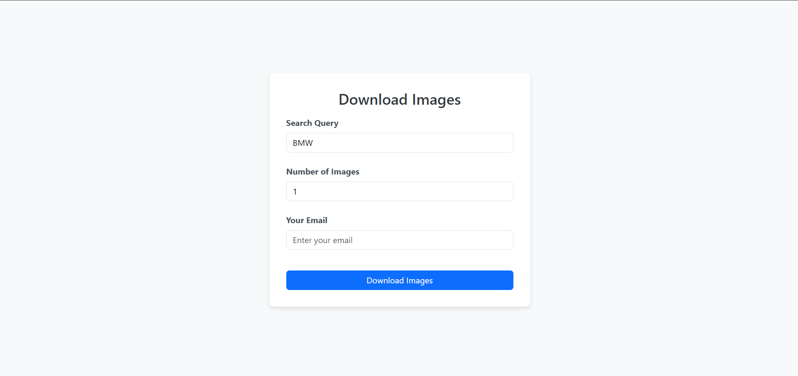
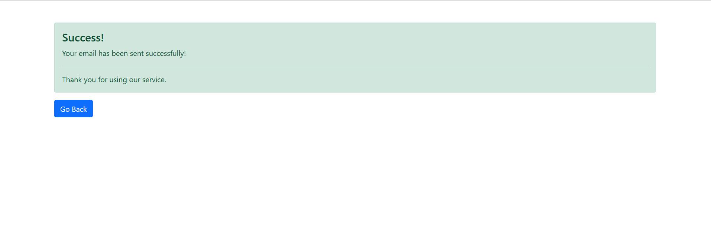

# Google Image Downloader

A Python-based web application to download images from Google search results. This tool leverages Google's custom image search API to retrieve images based on a search query and allows you to save them to your local machine.

## Features
- Search for images by keywords.
- Download images directly to your local machine.
- Specify the number of images to download.
- Simple and easy-to-use interface.

## Requirements
- Python 3.x
- Google Custom Search API key
- Google Custom Search Engine (CSE) ID

## Installation

### Step 1: Clone the repository
```bash
git clone https://github.com/shaurya-bhatia-sb/Google-Image-Downloader.git
cd Google-Image-Downloader
```

### Step 2:  Install required packages
  ```
pip install -r requirements.txt
  ```

### Step 3: Configure the API keys and email settings:
1. Go to the Google Cloud Console.
2. Create a new project (if you don't have one).
3. Enable the Custom Search API.
4. Generate an API key and save it for use.

### Step 4: Create a Custom Search Engine
1. Go to Google Custom Search Engine.
2. Create a new search engine.
3. Retrieve the Search Engine ID (CSE ID).

### Step 5: Configure API and CSE ID
1. Create a .env file in the project directory.
2. Add the following configuration:
  ```
API_KEY = 'YOUR_GOOGLE_API_KEY'
CSE_ID = 'YOUR_CSE_ID'
SENDER_EMAIL = 'your_email@example.com'
SENDER_PASSWORD = 'your_email_password'
  ```

## Web Preview

### Homepage


### Success


## Usage
1.  Launch the app and enter the desired search tag (e.g., "car").
2.  Specify the number of images to download.
3.  The app will download the images to the location you specified.


## Code Overview

1. app.py: Contains logic for interacting with the Google API, downloading images, and saving them to the designated folder.
2. Email functionality for notifications after images are downloaded.
3. The app allows the user to define the search tag and the number of images to be retrieved.


## Contributing
Feel free to fork the repository and submit pull requests. If you encounter any bugs or have suggestions for improvements, please open an issue.
  


